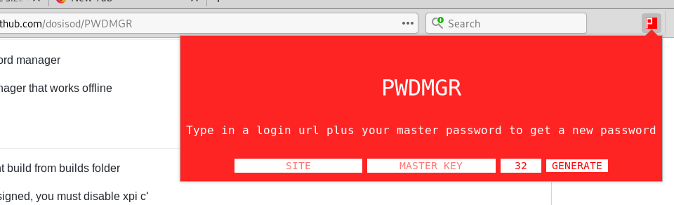

# PWDMGR
Offline Firefox password manager

Simple password manager that works offline

## Installing (Version 2.0+)

Download most recent build from [builds](builds/) folder

Verify hash against hash for your version in [builds/checksum](builds/checksum)

Goto `about:addons` click the gear -> "Install Add-on From File" -> select `.xpi` file

Done!

## Installing OLD (Versions 1.1, 1.0)

Download desired build from [builds](builds/)

Verify hash against hash for your version in [builds/checksum](builds/checksum)

As the (older) packages are unsigned, you must disable xpi checking:

Goto `about:config` in the search bar

Search for `xpinstall.signatures.required` and set it to false

Then goto `about:addons` and hit the gear next to search bar

click `Install Add-on From File` and select the `.xpi` file

Done!

## This add-on "appears to be corrupt"

This error is caused by using an old version of Firefox that is known to remove add-ons

Updating to the newest version of Firefox and reinstalling add-on will fix this